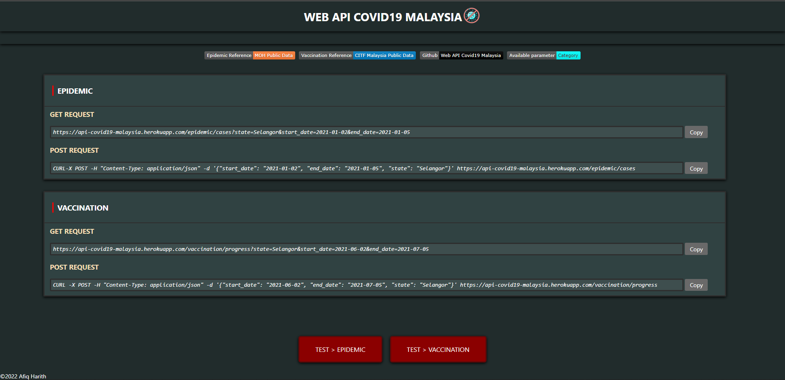

# WEB API COVID19 MALAYSIA

<div align="center" style="border:solid; border-size: 0.4vmin">
  
</div>

### 1. Install dependencies

Run:

```sh
$ pip3 install -r requirements.txt
```

### 2. Run project

Run:

```sh
$ python3 wsgi.py
```

### 3. Query

| Category    | Fields                         | Query                         |
| :---------- | :----------------------------- | :---------------------------- |
| index       | None                           | None                          |
| epidemic    | cases, deaths, tests, hospital | start_date, end_date, \*state |
| vaccination | registration, progress         | start_date, end_date, state   |

Available states:

- Johor
- Kedah
- Kelantan
- Melaka
- Negeri Sembilan
- Pahang
- Perak
- Perlis
- Pulau Pinang
- Sabah
- Sarawak
- Selangor
- Terengganu
- W.P. Kuala Lumpur
- W.P. Labuan
- W.P. Putrajaya

Check out:

```sh
CURL-X POST -H "Content-Type: application/json" https://api-covid19-malaysia.herokuapp.com/category
```

### 5. Access data using GET request

Fetching epidemic category data example:

```sh
https://api-covid19-malaysia.herokuapp.com/epidemic/cases?state=Selangor&start_date=2021-01-02&end_date=2021-01-05
```

Fetching vaccination category data example:

```sh
https://api-covid19-malaysia.herokuapp.com/vaccination/registration?state=Selangor&start_date=2021-06-02&end_date=2021-07-05
```

### 6. Access data using JSON POST request

Fetching epidemic category data example:

```sh
CURL-X POST -H "Content-Type: application/json" -d '{"start_date": "2021-02-03", "end_date": "2021-07-05", "state": "Selangor"}' https://api-covid19-malaysia.herokuapp.com/epidemic/cases
```

Fetching vaccination category data example:

```sh
CURL -X POST -H "Content-Type: application/json" -d '{"start_date": "2021-02-03", "end_date": "2021-07-05", "state": "Selangor"}'  https://api-covid19-malaysia.herokuapp.com/vaccination/progress
```

### 7. Heroku-App

[](https://api-covid19-malaysia.herokuapp.com/)
